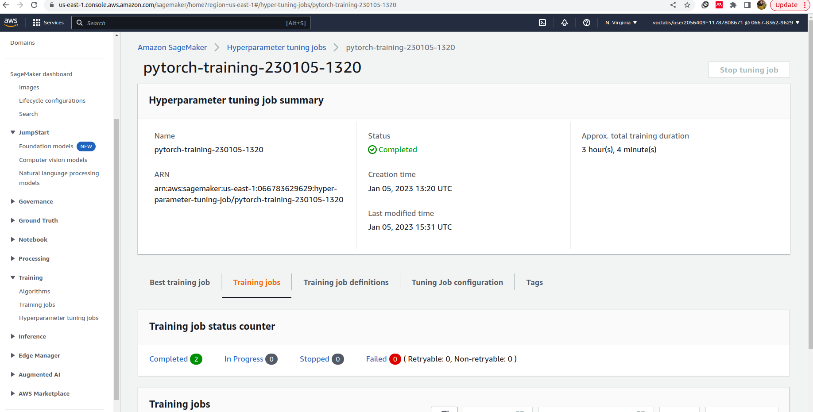

# Image Classification using AWS SageMaker

In this project AWS Sagemaker is used to finetune a pretrained model that can perform image classification by using the Sagemaker profiling, debugger, hyperparameter tuning and other ML engineering practices.

The model is ResNet-50 is used, on the dataset of Dog Breed Classification.

## Project Set Up and Installation
Enter AWS through the gateway in the course and open SageMaker Studio. 
Download the starter files.
Download/Make the dataset available. 

The main files are:
1. train_and_deploy.ipynb: the notebook where we create, train, deploy our estimators and interact with SageMaker
2. hpo.py: the script for hyperparameter tuning
3. train_model.py: the script for training the model with the best hyperparameters and using the debugger and profiles

Make sure to use a kernel type that matches the framework requirements and install smdebug as instructed in the notebook

## Dataset
The dataset is the dog breed classification which contains 133 different classes.
### Access
Upload the data to an S3 bucket through the AWS Gateway so that SageMaker has access to the data. 

## Hyperparameter Tuning
What kind of model did you choose for this experiment and why? Give an overview of the types of parameters and their ranges used for the hyperparameter search

I used a residual network ResNet-50. ResNet architecture are known for overcoming vanishing gradients using skip connections. ResNet can achieve good results like VGG for example with being less complex.

The hyperparameters search included the following:

1. number of epochs: this is an important hyperparameter to determine the length of the training and reach optimal results without overfitting.
2. learning rate: the learning rate is important to reach our minima, we need a value that is is not so large that the model oscilates and misses the minimum point nor too small that the weight updates are small
3. batch size: optimally we want to fit our whole dataset and make updates based on it, but this is computationally not possible, therefore, we need to choose a batch size big enough and compatible with our resources

### AWS Hyperparameter Tuning Jobs

#### hyperparameter tuning job


#### training jobs


#### best hyperparameters


#### training logs


## Debugging and Profiling
In order to utilize SageMaker Debugger and profiler the following steps are needed:
1. Create rules and configs based on what we need.
2. Pass those configuration to our Estimator
3. Configure a hook in the training script
After training is done we can fetch the data from S3.

### Results
1. As seen in the profiler, the most triggered rule is the BatchSize which indicates that batchsize is small and I may need to increase to fully utilize my resources or choose a different instance.
2. LowGPUUtilization since I did not use the GPU
3. CPUBottleneck was above the set threshold so I might consider changing my data loaders.


## Model Deployment
We can deploy the model using the SDK and specifiying instance count and type.
```
estimator_path = "s3://sagemaker-us-east-1-066783629629/Breed-classification-2023-01-05-16-01-59-814/output/model.tar.gz"
trained_model = PyTorch(
    model_data=estimator_path,
    entry_point="./infernce2.py",
    framework_version="1.8",
    py_version="py36",
    role=role)
my_estimator = trained_model.attach(training_job_name)

predictor=my_estimator.deploy(initial_instance_count=1, instance_type="ml.m5.xlarge")
```
Then we can get a data instance from S3 and pass it to our model to get the inference
```
response = predictor.predict(img_bytes, initial_args={"ContentType": "image/jpeg"})
```

#### the deployed end point in SageMaker


